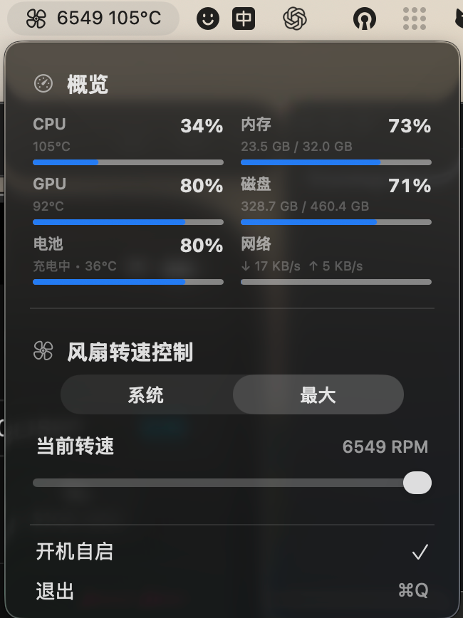

# MacBoard

[简体中文](README.md) | [English](README.en.md)

一款轻量级 macOS 菜单栏硬件看板，可集中查看 CPU、GPU、内存、磁盘、电池、网络、温度和风扇状态，并在支持的 Mac 上控制风扇。

它通过私有的 AppleSMC 服务读取风扇转速、转速范围、强制控制状态和温度传感器。写入操作通常需要 `sudo` 权限。

## 界面预览



紧凑的菜单中会显示当前可用的系统占用、温度和风扇控制；不支持或无法采集的数据会自动隐藏。

## 构建

```sh
swift build -c release
```

构建后的命令行程序位于：

```sh
.build/release/fanctl
```

## 命令

```sh
fanctl status
fanctl temps
fanctl fans
sudo fanctl max
sudo fanctl manual 0 3600
sudo fanctl system
fanctl keys T
fanctl raw F0Ac
```

`system` 会取消强制风扇控制，并将风扇交还给 macOS 管理。`max` 会把检测到的全部风扇设置为硬件报告的最高转速。`manual` 会先检查硬件报告的最低和最高转速范围，再将指定风扇设置为目标 RPM。

`raw` 用于输出单个 SMC 键的数据类型和原始字节，适合在适配新 Mac 机型时进行诊断。

在不提供旧式 `FS!` 强制风扇掩码的 Apple 芯片 Mac 上，本工具会使用每个风扇的 `F0Md`/`F1Md` 模式键，并按照目标 SMC 键已经报告的数据类型写入 RPM。

## 菜单栏应用

构建并启动菜单栏应用：

```sh
scripts/build-app.sh
open "dist/MacBoard.app"
```

构建带拖拽安装界面的 Intel 与 Apple 芯片通用 DMG：

```sh
scripts/build-dmg.sh
```

菜单栏应用可显示 CPU、GPU、内存、磁盘、电池、网络、风扇和温度信息。无法采集的数据会自动隐藏；如果设备没有风扇，则不会显示风扇控制模块。

首次执行风扇控制操作时，应用会在获得一次管理员授权后安装 root LaunchDaemon 辅助服务。后续操作通过 `/var/run/fancontroller.sock` 与该服务通信，不会反复要求输入密码。

移除辅助服务：

```sh
sudo launchctl bootout system /Library/LaunchDaemons/local.fan-controller.helper.plist
sudo rm -f /Library/LaunchDaemons/local.fan-controller.helper.plist
sudo rm -f /Library/PrivilegedHelperTools/local.fan-controller.helper
sudo rm -f /var/run/fancontroller.sock
```

## 安全说明

本工具使用 macOS 私有且未公开文档的硬件接口。不同 Mac 机型和 macOS 版本能够读取的传感器及允许写入的 SMC 键可能不同。

请勿将手动风扇转速设置到硬件报告范围之外。测试完成后，应使用 `system` 将风扇控制权交还给 macOS：

```sh
sudo .build/release/fanctl system
```

如果 Mac 没有风扇、AppleSMC 阻止访问某个键，或者目标键使用不受支持的数据类型，工具会隐藏对应信息或拒绝操作，而不会猜测硬件参数。

## 随喜打赏

如果你喜欢的话，可以随喜打赏，多少都是心意，一分不嫌少，一亿不嫌多。

<p align="center">
  
  &nbsp;&nbsp;
  
</p>
