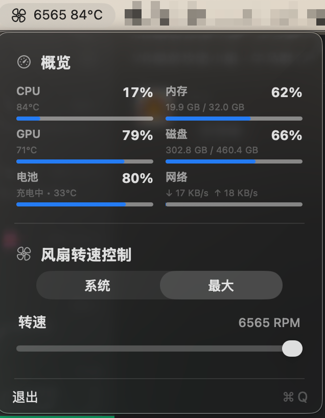

# Fan Controller

[English](README.md) | [简体中文](README.zh-CN.md)

A small macOS command-line and menu-bar monitoring tool with fan control, temperature sensors, and a compact system overview.

It talks to the private AppleSMC service to read fan speed, fan limits, forced fan state, and temperature sensors. Write operations normally require `sudo`.

## Preview



The compact menu shows available system usage, temperatures, and fan controls. Unsupported or unavailable data is hidden automatically.

## Build

```sh
swift build -c release
```

The executable is created at:

```sh
.build/release/fanctl
```

## Commands

```sh
fanctl status
fanctl temps
fanctl fans
sudo fanctl max
sudo fanctl manual 0 3600
sudo fanctl system
fanctl keys T
fanctl raw F0Ac
```

`system` clears forced fan control and returns the fans to macOS. `max` sets every detected fan to its reported hardware maximum. `manual` sets one fan to a specific RPM after checking the reported min/max range.

`raw` prints a single SMC key's data type and bytes. It is useful when adapting the tool to a new Mac model.

On Apple Silicon Macs that do not expose the legacy `FS!` forced-fan mask, this tool uses each fan's `F0Md`/`F1Md` mode key and writes RPM values using the SMC data type already reported by the target key.

## Menu Bar App

Build and launch the menu bar app:

```sh
scripts/build-app.sh
open "dist/Fan Controller.app"
```

Build the polished universal DMG with the drag-to-Applications installer layout:

```sh
scripts/build-dmg.sh
```

The menu bar app shows CPU load, memory, disk, battery, fan speed/control, and temperature sensors. The first fan-control action installs a root LaunchDaemon helper after one administrator authorization. Later menu actions talk to that helper through `/var/run/fancontroller.sock`, so they do not repeatedly ask for a password.

To remove the helper:

```sh
sudo launchctl bootout system /Library/LaunchDaemons/local.fan-controller.helper.plist
sudo rm -f /Library/LaunchDaemons/local.fan-controller.helper.plist
sudo rm -f /Library/PrivilegedHelperTools/local.fan-controller.helper
sudo rm -f /var/run/fancontroller.sock
```

## Safety

This uses private, undocumented macOS hardware interfaces. The readable sensors and writable keys vary by Mac model and macOS version. Do not run manual fan speeds outside the reported range, and use `system` to return control to macOS after testing:

```sh
sudo .build/release/fanctl system
```

If a Mac has no fan or AppleSMC blocks a key, the command will report that instead of guessing.
